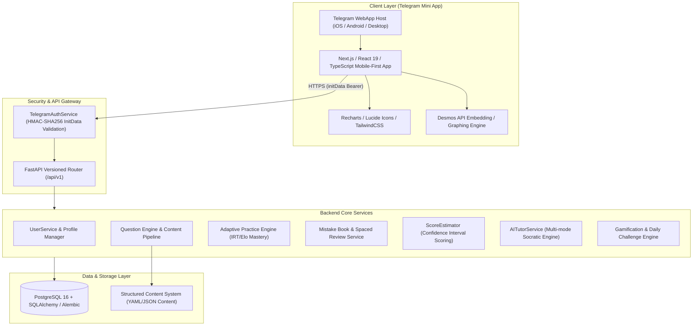

# SAT MASTER — System Architecture

## 1. Executive Summary

**SAT MASTER** is an intelligent, adaptive Telegram Mini App designed for rigorous Digital SAT preparation. Engineered to elevate a student from an initial baseline (e.g., 700 SAT: Math ~360, Reading & Writing ~340) to a competitive target of **1400+ over a disciplined 4-month trajectory**, the system moves beyond rote drill-and-practice. Instead, it implements a continuous diagnostic, remedial, and spaced-retention loop.

```
       ┌───────────────┐
       │   DIAGNOSE    │
       └───────┬───────┘
               ▼
       ┌───────────────┐
       │     TEACH     │ ◄────────────────────────┐
       └───────┬───────┘                          │
               ▼                                  │
       ┌───────────────┐                          │
       │   PRACTICE    │                          │
       └───────┬───────┘                          │
               ▼                                  │
       ┌───────────────┐                          │
       │    ANALYZE    │                          │
       └───────┬───────┘                          │
               ▼                                  │
       ┌───────────────┐                          │
       │ IDENTIFY GAP  │                          │
       └───────┬───────┘                          │
               ▼                                  │
       ┌───────────────┐                          │
       │   REMEDIATE   │ ─────────────────────────┘
       └───────┬───────┘ (Retest & reinforce)
               ▼
       ┌───────────────┐
       │INCREASE LEVEL │
       └───────────────┘
```

---

## 2. High-Level Architecture

The system is organized into a modular 3-tier architecture with an asynchronous AI orchestration and analytics layer:



---

## 3. Technology Stack

### Frontend
- **Framework**: Next.js 14+ (App Router), React 18/19, TypeScript (Strict Mode).
- **Styling**: TailwindCSS, CSS Variables (Telegram theme variable adaptation `@telegram-apps/sdk` / CSS vars for light/dark dynamic switching).
- **State Management & Data Fetching**: TanStack React Query v5 (caching, optimistic updates, offline resilience) + Zustand (client state, active quiz session).
- **Math & Charts**: KaTeX (for mathematical formulas rendering), Recharts (for progress, mastery radar, score progression).
- **Telegram SDK**: `@telegram-apps/sdk-react` or native Telegram WebApp script.

### Backend
- **Framework**: Python 3.11+ / FastAPI (high performance ASGI, native async/await, Pydantic v2 validation).
- **ORM**: SQLAlchemy 2.0 (asyncio with `asyncpg` for PostgreSQL, SQLite support for rapid local zero-dependency testing).
- **Migrations**: Alembic.
- **Security & Cryptography**: `hashlib`, `hmac` for Telegram initData cryptographic validation; `pydantic-settings` for secure env configuration.
- **AI Integration**: Multi-provider agnostic client (OpenAI / Anthropic / Google Gemini API client) with Socratic prompt guards.

### Database
- **Primary Database**: PostgreSQL 16+.
- **Indexes**: Composite indexes on `(user_id, topic_id)`, `(user_id, next_review_at)`, and GIN indexes on question tags/metadata.

---

## 4. Telegram Mini App Security & Authentication

### 4.1. Cryptographic Validation Flow
Telegram WebApp transmits user credentials wrapped in `initData`. Client-side user ID inputs are **strictly untrusted**.

1. The frontend extracts `window.Telegram.WebApp.initData` as a raw URL-encoded query string.
2. The frontend POSTs `{"init_data": "<raw_init_data>"}` to `/api/v1/auth/telegram`.
3. The backend `TelegramAuthService`:
   - Parses the query string into key-value pairs.
   - Extracts the `hash` parameter and excludes it from the data check string.
   - Sorts remaining keys alphabetically and formats as `key=value\n`.
   - Computes a secret key: `HMAC_SHA256("WebAppData", bot_token)`.
   - Computes data signature: `HMAC_SHA256(secret_key, data_check_string)`.
   - Compares computed signature with provided hash using constant-time comparison (`hmac.compare_digest`).
   - Verifies `auth_date` timestamp freshness (rejecting requests older than 24 hours).
4. Once verified, the backend extracts the verified `id`, `first_name`, `last_name`, `username`, and `photo_url`.

### 4.2. Application Session & JWT Token Model
Raw Telegram `initData` is never used as a persistent session. Upon successful validation:
1. `UserService` looks up or registers the student by `telegram_id`.
2. Backend generates a signed, short-lived **JWT Access Token** (`HS256`, 7-day expiration).
   - Payload: `{"sub": "<user_uuid>", "iat": <now>, "exp": <expire>, "type": "access"}`.
   - **Zero Secrets Injected**: No Telegram bot token, DB credentials, or sensitive data exist in the token.
3. The frontend stores this token in secure client-side storage and supplies `Authorization: Bearer <token>` on all future requests (e.g. `GET /api/v1/users/me`).

### 4.3. User & Learning Profile Separation
The system splits user data into two decoupled layers:
- **`User` (Account & Identity)**: `telegram_id` (primary identity key), names, username, avatar, level, XP, timestamps.
- **`UserProfile` (Pedagogical State)**: `target_score` (default 1400), `diagnostic_status` (`not_started`, `in_progress`, `completed`), `study_goal`, `daily_goal_minutes`, and section estimates.
  - Initial state after first registration is strictly `diagnostic_status = "not_started"`. No false baseline statistics are fabricated.

### 4.4. Development Browser Behavior
When launching in a standard desktop browser outside Telegram:
- The frontend detects that `Telegram.WebApp` is not active.
- Instead of crashing or fabricating user credentials, the app gracefully presents **Development Browser Mode**.
- Developers can click `[Connect as Dev Student]` to trigger `/api/v1/auth/dev` (strictly disabled when `APP_ENV=production`), allowing full UI and API validation without native Telegram clients.

---

## 5. API Design & Versioning

All endpoints are versioned under `/api/v1/`:

| Endpoint Prefix | Purpose |
|-----------------|---------|
| `/api/v1/auth/telegram` | Validates initData, returns user session/JWT or user profile |
| `/api/v1/users/me` | Current user profile, target score, baseline, preferences |
| `/api/v1/dashboard` | Aggregated dashboard: current estimate, streak, today's plan, weak topics |
| `/api/v1/questions` | Filtered questions, random selection, individual question lookup, and attempt submission (`POST /api/v1/questions/{id}/attempt`) |
| `/api/v1/adaptive` | Adaptive practice sessions: `GET /next`, `GET /analytics`, `POST /session`, `GET /session/current`, `GET /session/{id}`, `POST /session/{id}/questions/{qid}/answer` |
| `/api/v1/mistakes` | Mistake book querying, mistake categorization, retry queue |
| `/api/v1/lessons` | Topic lessons, concept walkthroughs, SAT shortcuts |
| `/api/v1/desmos` | Desmos Lab: `GET /techniques`, `GET /techniques/{slug}`, `GET /questions`, `POST /session`, `GET /session/current`, `GET /session/{id}`, `POST /session/{id}/questions/{qid}/answer`, `POST /session/{id}/abandon`, `GET /analytics` |
| `/api/v1/ai/tutor` | AI Tutor assistance (HINT, EXPLAIN, SOLVE, ANOTHER_METHOD, SAT_TRICK) |
| `/api/v1/diagnostics` | Diagnostic test lifecycle: start/resume, get current progress, submit answers, and retrieve score estimation reports (`/latest/result`, `/{id}/result`) |
| `/api/v1/tests/full` | Full SAT exam simulations (timed modules) |
| `/api/v1/analytics/progress`| Detailed historical performance and mastery heatmaps |
| `/api/v1/gamification` | XP, levels, streak tracking, daily challenges, achievements |
| `/api/v1/duels` | Real-time / asynchronous competitive match management |

---

## 6. Reliability, Error Handling & Logging

- **Structured Logging**: JSON-formatted logs with request IDs, user IDs, and timing metrics.
- **Centralized Exception Handling**: Custom HTTP exceptions (`EntityNotFoundException`, `UnauthorizedException`, `ValidationException`) returning uniform RFC 7807 problem details.
- **Graceful Degradation**: If external AI services encounter rate limits or outages, the AI Tutor gracefully falls back to pre-authored static hints and explanations stored directly with the question.
- **Data Integrity**: Atomic transactions for test submissions and XP updates.
