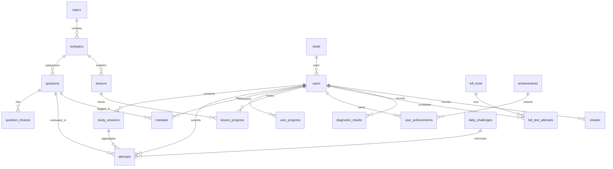

# SAT MASTER — Database Architecture & Schema Specification

## 1. Overview & Principles

The database layer is built on **PostgreSQL 16+** using **SQLAlchemy 2.0 async ORM** and **Alembic** migrations.
It is architected to support:
- Tens of thousands of SAT questions across Math and Reading & Writing domains.
- Fine-grained per-question attempt analytics and microsecond response-time tracking.
- An intelligent **Mistake Book** with error-type taxonomy.
- Dynamic **Spaced Repetition** queues.
- Real-time **Adaptive Difficulty** tracking and **Simulated Digital SAT** multi-module state machines.

---

## 2. Entity-Relationship Diagram



---

## 3. Relational Schema Specification

### 3.1. Users & Authentication
```sql
CREATE TABLE users (
    id UUID PRIMARY KEY DEFAULT gen_random_uuid(),
    telegram_id BIGINT UNIQUE NOT NULL,
    username VARCHAR(255),
    first_name VARCHAR(255) NOT NULL,
    last_name VARCHAR(255),
    language_code VARCHAR(10) DEFAULT 'en',
    avatar_url TEXT,
    target_score INT DEFAULT 1400,
    current_score_estimate INT DEFAULT 700,
    math_estimate INT DEFAULT 360,
    rw_estimate INT DEFAULT 340,
    level INT DEFAULT 1,
    xp INT DEFAULT 0,
    is_active BOOLEAN DEFAULT TRUE,
    created_at TIMESTAMPTZ DEFAULT NOW(),
    last_active_at TIMESTAMPTZ DEFAULT NOW()
);

CREATE INDEX idx_users_telegram_id ON users(telegram_id);

CREATE TABLE user_profiles (
    id UUID PRIMARY KEY DEFAULT gen_random_uuid(),
    user_id UUID UNIQUE NOT NULL REFERENCES users(id) ON DELETE CASCADE,
    target_score INT DEFAULT 1400 NOT NULL,
    diagnostic_status VARCHAR(32) DEFAULT 'not_started' NOT NULL, -- 'not_started', 'in_progress', 'completed'
    study_goal VARCHAR(255) DEFAULT 'Score 1400+ in 4 months' NOT NULL,
    daily_goal_minutes INT DEFAULT 30 NOT NULL,
    math_estimate INT,
    rw_estimate INT,
    created_at TIMESTAMPTZ DEFAULT NOW(),
    updated_at TIMESTAMPTZ DEFAULT NOW()
);

CREATE INDEX idx_user_profiles_user_id ON user_profiles(user_id);
```

### 3.2. Topics, Subtopics & Lessons
```sql
CREATE TABLE topics (
    id UUID PRIMARY KEY DEFAULT gen_random_uuid(),
    section VARCHAR(32) NOT NULL, -- 'math', 'reading_writing'
    domain VARCHAR(64) NOT NULL,  -- e.g., 'Algebra', 'Advanced Math', 'Craft and Structure'
    name VARCHAR(128) NOT NULL,
    description TEXT,
    order_index INT DEFAULT 0,
    created_at TIMESTAMPTZ DEFAULT NOW()
);

CREATE TABLE subtopics (
    id UUID PRIMARY KEY DEFAULT gen_random_uuid(),
    topic_id UUID NOT NULL REFERENCES topics(id) ON DELETE CASCADE,
    name VARCHAR(128) NOT NULL,
    skill_code VARCHAR(64) NOT NULL, -- e.g., 'ALG_LIN_EQ', 'RW_CONV_BOUND'
    description TEXT,
    order_index INT DEFAULT 0
);

CREATE TABLE lessons (
    id UUID PRIMARY KEY DEFAULT gen_random_uuid(),
    subtopic_id UUID NOT NULL REFERENCES subtopics(id) ON DELETE CASCADE,
    title VARCHAR(255) NOT NULL,
    concept_summary TEXT NOT NULL,
    simple_explanation TEXT NOT NULL,
    example_problem JSONB NOT NULL,
    sat_shortcut TEXT,
    desmos_trick TEXT,
    common_traps JSONB,
    order_index INT DEFAULT 0,
    created_at TIMESTAMPTZ DEFAULT NOW()
);

CREATE TABLE lesson_progress (
    id UUID PRIMARY KEY DEFAULT gen_random_uuid(),
    user_id UUID NOT NULL REFERENCES users(id) ON DELETE CASCADE,
    lesson_id UUID NOT NULL REFERENCES lessons(id) ON DELETE CASCADE,
    is_completed BOOLEAN DEFAULT FALSE,
    completed_at TIMESTAMPTZ,
    UNIQUE(user_id, lesson_id)
);
```

### 3.3. Question Engine, Passages & Options (Implemented in Migration 003)
```sql
CREATE TABLE passages (
    id UUID PRIMARY KEY DEFAULT gen_random_uuid(),
    title VARCHAR(255),
    passage_text TEXT NOT NULL,
    source_info TEXT,
    created_at TIMESTAMPTZ DEFAULT NOW(),
    updated_at TIMESTAMPTZ DEFAULT NOW()
);

CREATE TABLE questions (
    id UUID PRIMARY KEY DEFAULT gen_random_uuid(),
    passage_id UUID REFERENCES passages(id) ON DELETE SET NULL,
    subject VARCHAR(32) NOT NULL, -- 'MATH', 'READING_WRITING'
    domain VARCHAR(64) NOT NULL,
    skill VARCHAR(128) NOT NULL,
    subskill VARCHAR(128),
    question_type VARCHAR(32) DEFAULT 'MULTIPLE_CHOICE' NOT NULL, -- 'MULTIPLE_CHOICE', 'SPR'
    difficulty VARCHAR(16) NOT NULL, -- 'EASY', 'MEDIUM', 'HARD'
    question_text TEXT NOT NULL,
    explanation TEXT NOT NULL,
    hint TEXT,
    sat_shortcut TEXT,
    estimated_time_seconds INT DEFAULT 75 NOT NULL,
    desmos_allowed BOOLEAN DEFAULT TRUE NOT NULL,
    desmos_recommended BOOLEAN DEFAULT FALSE NOT NULL,
    status VARCHAR(32) DEFAULT 'PUBLISHED' NOT NULL, -- 'DRAFT', 'PUBLISHED', 'ARCHIVED'
    created_at TIMESTAMPTZ DEFAULT NOW() NOT NULL,
    updated_at TIMESTAMPTZ DEFAULT NOW() NOT NULL
);

CREATE INDEX ix_questions_passage_id ON questions(passage_id);
CREATE INDEX ix_questions_subject ON questions(subject);
CREATE INDEX ix_questions_domain ON questions(domain);
CREATE INDEX ix_questions_skill ON questions(skill);
CREATE INDEX ix_questions_difficulty ON questions(difficulty);
CREATE INDEX ix_questions_status ON questions(status);

CREATE TABLE question_options (
    id UUID PRIMARY KEY DEFAULT gen_random_uuid(),
    question_id UUID NOT NULL REFERENCES questions(id) ON DELETE CASCADE,
    label VARCHAR(4) NOT NULL, -- 'A', 'B', 'C', 'D'
    text TEXT NOT NULL,
    order_index INT DEFAULT 0 NOT NULL,
    is_correct BOOLEAN DEFAULT FALSE NOT NULL
);

CREATE INDEX ix_question_options_question_id ON question_options(question_id);

CREATE TABLE question_attempts (
    id UUID PRIMARY KEY DEFAULT gen_random_uuid(),
    user_id UUID NOT NULL REFERENCES users(id) ON DELETE CASCADE,
    question_id UUID NOT NULL REFERENCES questions(id) ON DELETE CASCADE,
    selected_option_id UUID NOT NULL REFERENCES question_options(id) ON DELETE CASCADE,
    is_correct BOOLEAN NOT NULL,
    time_spent_seconds INT DEFAULT 0 NOT NULL,
    answered_at TIMESTAMPTZ DEFAULT NOW() NOT NULL
);

CREATE INDEX ix_question_attempts_user_id ON question_attempts(user_id);
CREATE INDEX ix_question_attempts_question_id ON question_attempts(question_id);
CREATE INDEX ix_question_attempts_answered_at ON question_attempts(answered_at);
```


### 3.4. Attempts & User Progress
```sql
CREATE TABLE study_sessions (
    id UUID PRIMARY KEY DEFAULT gen_random_uuid(),
    user_id UUID NOT NULL REFERENCES users(id) ON DELETE CASCADE,
    session_type VARCHAR(32) NOT NULL, -- 'practice', 'diagnostic', 'daily_challenge', 'full_sat', 'duel'
    started_at TIMESTAMPTZ DEFAULT NOW(),
    ended_at TIMESTAMPTZ,
    total_questions INT DEFAULT 0,
    correct_questions INT DEFAULT 0,
    total_time_seconds INT DEFAULT 0,
    xp_earned INT DEFAULT 0
);

CREATE TABLE attempts (
    id UUID PRIMARY KEY DEFAULT gen_random_uuid(),
    session_id UUID REFERENCES study_sessions(id) ON DELETE SET NULL,
    user_id UUID NOT NULL REFERENCES users(id) ON DELETE CASCADE,
    question_id UUID NOT NULL REFERENCES questions(id) ON DELETE CASCADE,
    selected_answer VARCHAR(255) NOT NULL,
    is_correct BOOLEAN NOT NULL,
    time_spent_seconds INT NOT NULL,
    hints_used INT DEFAULT 0,
    ai_tutor_consulted BOOLEAN DEFAULT FALSE,
    created_at TIMESTAMPTZ DEFAULT NOW()
);

CREATE INDEX idx_attempts_user_qid ON attempts(user_id, question_id);
CREATE INDEX idx_attempts_user_created ON attempts(user_id, created_at DESC);

CREATE TABLE user_progress (
    id UUID PRIMARY KEY DEFAULT gen_random_uuid(),
    user_id UUID NOT NULL REFERENCES users(id) ON DELETE CASCADE,
    subtopic_id UUID NOT NULL REFERENCES subtopics(id) ON DELETE CASCADE,
    total_attempted INT DEFAULT 0,
    total_correct INT DEFAULT 0,
    accuracy FLOAT DEFAULT 0.0,
    mastery_level FLOAT DEFAULT 0.0, -- 0.0 to 1.0 scale
    last_practiced_at TIMESTAMPTZ,
    UNIQUE(user_id, subtopic_id)
);
```

### 3.5. Mistake Book & Spaced Repetition
```sql
CREATE TABLE mistakes (
    id UUID PRIMARY KEY DEFAULT gen_random_uuid(),
    user_id UUID NOT NULL REFERENCES users(id) ON DELETE CASCADE,
    question_id UUID NOT NULL REFERENCES questions(id) ON DELETE CASCADE,
    attempt_id UUID REFERENCES attempts(id) ON DELETE SET NULL,
    user_answer VARCHAR(255) NOT NULL,
    correct_answer VARCHAR(255) NOT NULL,
    time_spent_seconds INT NOT NULL,
    mistake_type VARCHAR(64) DEFAULT 'concept_gap', 
    -- 'concept_gap', 'careless_mistake', 'misread_question', 'time_pressure', 'calculation_error', 'vocabulary_gap', 'grammar_gap', 'strategy_error'
    explanation_seen BOOLEAN DEFAULT FALSE,
    remediation_status VARCHAR(32) DEFAULT 'unresolved', -- 'unresolved', 'in_review', 'resolved'
    review_count INT DEFAULT 0,
    next_review_at TIMESTAMPTZ DEFAULT NOW(),
    interval_days INT DEFAULT 1,
    ease_factor FLOAT DEFAULT 2.5,
    created_at TIMESTAMPTZ DEFAULT NOW(),
    updated_at TIMESTAMPTZ DEFAULT NOW()
);

CREATE INDEX idx_mistakes_user_review ON mistakes(user_id, remediation_status, next_review_at);
```

### 3.6. Diagnostic & Full SAT Exams
```sql
CREATE TABLE diagnostic_tests (
    id UUID PRIMARY KEY DEFAULT gen_random_uuid(),
    title VARCHAR(255) NOT NULL,
    total_questions INT DEFAULT 30,
    time_limit_minutes INT DEFAULT 45
);

CREATE TABLE diagnostic_results (
    id UUID PRIMARY KEY DEFAULT gen_random_uuid(),
    user_id UUID NOT NULL REFERENCES users(id) ON DELETE CASCADE,
    diagnostic_test_id UUID REFERENCES diagnostic_tests(id) ON DELETE SET NULL,
    total_score INT NOT NULL,
    math_score INT NOT NULL,
    rw_score INT NOT NULL,
    weaknesses JSONB NOT NULL, -- Array of subtopic IDs / names
    strengths JSONB NOT NULL,
    completed_at TIMESTAMPTZ DEFAULT NOW()
);

CREATE TABLE full_tests (
    id UUID PRIMARY KEY DEFAULT gen_random_uuid(),
    title VARCHAR(255) NOT NULL,
    version INT DEFAULT 1,
    module1_rw_questions JSONB NOT NULL,
    module2_easy_rw_questions JSONB NOT NULL,
    module2_hard_rw_questions JSONB NOT NULL,
    module1_math_questions JSONB NOT NULL,
    module2_easy_math_questions JSONB NOT NULL,
    module2_hard_math_questions JSONB NOT NULL
);

CREATE TABLE full_test_attempts (
    id UUID PRIMARY KEY DEFAULT gen_random_uuid(),
    user_id UUID NOT NULL REFERENCES users(id) ON DELETE CASCADE,
    test_id UUID REFERENCES full_tests(id) ON DELETE CASCADE,
    current_module VARCHAR(32) NOT NULL,
    rw_module1_score INT,
    rw_module2_routed VARCHAR(16), -- 'easy' or 'hard'
    rw_scaled_score INT,
    math_module1_score INT,
    math_module2_routed VARCHAR(16),
    math_scaled_score INT,
    total_scaled_score INT,
    score_range_low INT,
    score_range_high INT,
    is_completed BOOLEAN DEFAULT FALSE,
    started_at TIMESTAMPTZ DEFAULT NOW(),
    completed_at TIMESTAMPTZ
);
```

### 3.7. Gamification, Daily Challenges & Streaks
```sql
CREATE TABLE daily_challenges (
    id UUID PRIMARY KEY DEFAULT gen_random_uuid(),
    challenge_date DATE UNIQUE NOT NULL,
    question_ids JSONB NOT NULL, -- Array of 10 question UUIDs
    xp_reward INT DEFAULT 100
);

CREATE TABLE achievements (
    id UUID PRIMARY KEY DEFAULT gen_random_uuid(),
    code VARCHAR(64) UNIQUE NOT NULL, -- 'first_question', '100_questions', '7_day_streak', etc.
    title VARCHAR(128) NOT NULL,
    description TEXT NOT NULL,
    icon_name VARCHAR(64) NOT NULL,
    xp_reward INT DEFAULT 50
);

CREATE TABLE user_achievements (
    id UUID PRIMARY KEY DEFAULT gen_random_uuid(),
    user_id UUID NOT NULL REFERENCES users(id) ON DELETE CASCADE,
    achievement_id UUID NOT NULL REFERENCES achievements(id) ON DELETE CASCADE,
    unlocked_at TIMESTAMPTZ DEFAULT NOW(),
    UNIQUE(user_id, achievement_id)
);

CREATE TABLE streaks (
    id UUID PRIMARY KEY DEFAULT gen_random_uuid(),
    user_id UUID UNIQUE NOT NULL REFERENCES users(id) ON DELETE CASCADE,
    current_streak INT DEFAULT 0,
    longest_streak INT DEFAULT 0,
    last_activity_date DATE,
    freeze_tokens INT DEFAULT 0
);

CREATE TABLE duels (
    id UUID PRIMARY KEY DEFAULT gen_random_uuid(),
    player1_id UUID NOT NULL REFERENCES users(id) ON DELETE CASCADE,
    player2_id UUID REFERENCES users(id) ON DELETE SET NULL,
    status VARCHAR(32) DEFAULT 'waiting', -- 'waiting', 'active', 'finished'
    question_ids JSONB NOT NULL,
    player1_score INT DEFAULT 0,
    player2_score INT DEFAULT 0,
    winner_id UUID REFERENCES users(id) ON DELETE SET NULL,
    created_at TIMESTAMPTZ DEFAULT NOW(),
    finished_at TIMESTAMPTZ
);
```
