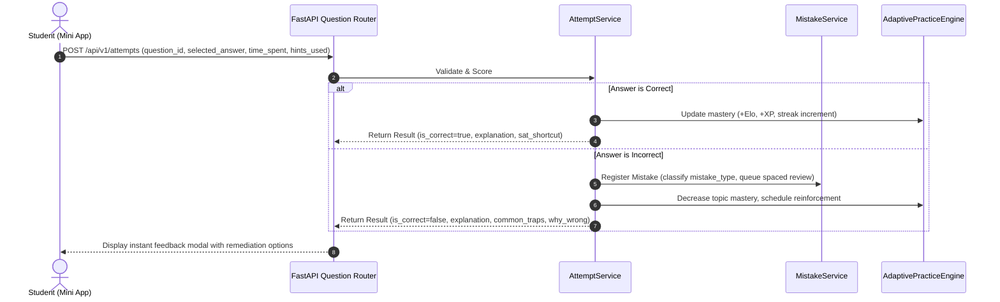

# SAT MASTER — Question Engine & Content Pipeline

## 1. Pedagogical Scope & Domain Taxonomy

SAT MASTER implements the official Digital SAT specification across both sections with rigorous topic taxonomy:

```
SAT MASTER CURRICULUM
├── Math (4 Domains)
│   ├── Algebra (Linear equations, systems, inequalities, linear graphs)
│   ├── Advanced Math (Quadratics, polynomials, nonlinear functions, transformations)
│   ├── Problem-Solving and Data Analysis (Ratios, percentages, statistics, probability)
│   └── Geometry and Trigonometry (Triangles, circles, trigonometry, volume)
└── Reading & Writing (4 Domains)
    ├── Information and Ideas (Central ideas, inferences, command of evidence)
    ├── Craft and Structure (Words in context, text structure, cross-text connection)
    ├── Expression of Ideas (Transitions, rhetorical synthesis)
    └── Standard English Conventions (Boundaries, agreement, verb tense, modifiers)
```

---

## 2. Question Object Specification

Every question record is modeled as a first-class learning artifact, carrying pedagogical metadata, two-stage progressive hints, SAT shortcuts, and Desmos instructions:

```typescript
interface Question {
  id: string;                      // UUID
  section: "math" | "reading_writing";
  domain: string;                  // e.g. "Algebra"
  skill: string;                   // e.g. "Linear Equations in Two Variables"
  subskill?: string;               // e.g. "Systems with No Solution"
  passageText?: string;            // Reading text or math word context
  questionText: string;            // In Markdown with KaTeX $...$ support
  questionType: "multiple_choice" | "student_produced";
  choices: {
    letter: "A" | "B" | "C" | "D";
    text: string;
  }[];
  correctAnswer: string;           // "A", "B", "C", "D" or string value for student-produced
  explanation: string;             // Detailed conceptual step-by-step resolution
  hints: {
    level1: string;                // Guiding Socratic hint without revealing answer
    level2: string;                // Formula / concrete intermediate step
  };
  satShortcut?: string;            // Fast test-taking trick / backsolving technique
  desmosTrick?: {
    expression: string;            // E.g. "y1 ~ m x1 + b" or "f(x) = x^2 - 4x + 3"
    instruction: string;           // E.g. "Look for intersection points along the x-axis"
  };
  difficulty: "easy" | "medium" | "hard";
  difficultyRating: number;        // Continuous scale (0.5 to 3.0)
  estimatedTimeSeconds: number;    // E.g., 60s for easy algebra, 120s for dense evidence
  tags: string[];                  // E.g., ["systems", "no-solution", "parallel-lines"]
  sourceType: "original" | "curated";
}
```

---

## 3. Digital SAT Content Quality Standards

1. **Copyright Compliance**: No proprietary College Board copyrighted test items are scraped or duplicated. All passages, problems, diagrams, and answer choices are original educational material specifically written to mirror Digital SAT formatting, vocabulary density, and trap mechanics.
2. **Pedagogical Integrity**:
   - Every question has an undeniable, unambiguously correct answer.
   - Distractors (incorrect choices) are deliberately engineered to target known cognitive traps (e.g., solving for $x$ when asked for $2x - 3$; misinterpreting percent change as percentage points; dangling modifiers).
   - Explanations break down **why** the correct answer works and **why each distractor fails**.
3. **LaTeX & KaTeX Rendering**:
   - Math equations are wrapped in standard `$...$` for inline expressions and `$$...$$` for block displays.
   - Clean typographical notation ($f(x) = ax^2 + bx + c$, $\sqrt{x}$, $\frac{a}{b}$).

---

## 4. Content Authoring Directory Structure

Content is decoupled from UI code into a structured repository format under `backend/content/` (seedable via migration scripts into PostgreSQL):

```
backend/content/
├── math/
│   ├── algebra/
│   │   ├── linear_equations.json
│   │   ├── systems_of_equations.json
│   │   └── linear_inequalities.json
│   ├── advanced_math/
│   │   ├── quadratic_functions.json
│   │   └── exponential_growth.json
│   ├── data_analysis/
│   │   ├── ratios_and_percentages.json
│   │   └── statistics_and_margin_of_error.json
│   └── geometry_trig/
│       ├── right_triangles_trig.json
│       └── circle_theorems.json
├── reading_writing/
│   ├── information_ideas/
│   │   ├── central_ideas.json
│   │   └── command_of_evidence.json
│   ├── craft_structure/
│   │   ├── words_in_context.json
│   │   └── text_structure_purpose.json
│   ├── expression_ideas/
│   │   ├── transitions.json
│   │   └── rhetorical_synthesis.json
│   └── conventions/
│       ├── sentence_boundaries.json
│       └── subject_verb_agreement.json
└── desmos/
    ├── shortcuts.json
    └── labs.json
```

---

## 5. Question Evaluation & Submission Lifecycle


